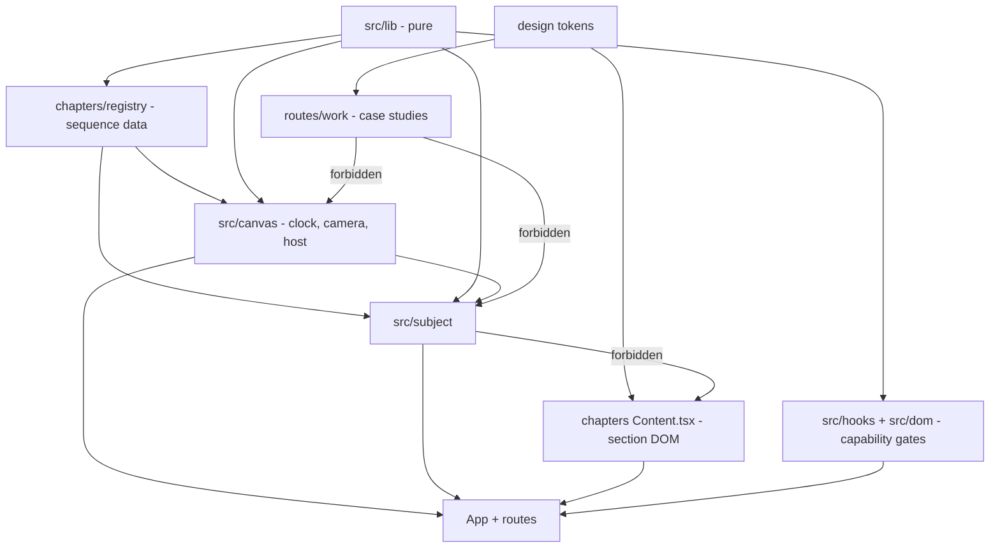
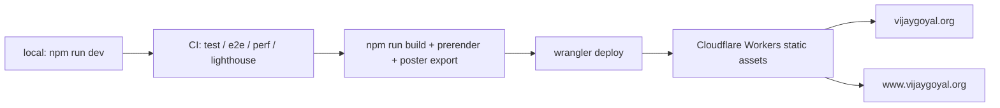

# Architecture Spine — vijaygoyal.org redesign

## Design Paradigm

**Deterministic scroll projection.** One scalar clock (normalised scroll
position) drives a pure projection to subject state, which is then applied
imperatively to one persistent scene graph. Unidirectional: nothing downstream
writes back upstream, and no animation holds time of its own.

The property that matters: because the projection is pure, the entire narrative
is assertable in jsdom without a GPU. That is what makes the motion testable at
all, and every rule below exists to keep it true.

The sequence is **data**, not a peer. `src/chapters/*/index.ts` (poses, camera
keyframes, ranges) is read by the clock, the camera and the subject; a
chapter's `Content.tsx` is DOM and is read by nobody below it. Splitting the
two is what breaks the cycle the original draft denied — `Subject`,
`CameraRig` and `ScrollDriver` all import the registry today, so a layer table
claiming otherwise was false.

| Layer | Directory | May depend on |
| --- | --- | --- |
| Pure functions (easing, progress, keyframes, tiering) | `src/lib/` | nothing in `src/` |
| Sequence data (poses, keyframes, ranges) | `src/chapters/*/index.ts`, `registry.ts` | `src/lib/`, `src/subject/state` types |
| Clock & renderer host | `src/canvas/` | `src/lib/`, sequence data |
| Subject (the device, its materials, its state) | `src/subject/` | `src/lib/`, sequence data, `src/canvas/` contracts |
| Reduced-motion & capability gates | `src/hooks/`, `src/dom/` | `src/lib/` |
| Section DOM | `src/chapters/*/Content.tsx` | tokens only |
| Routes & shell | `src/App.tsx`, `src/routes/` | all of the above |
| Case-study routes | `src/routes/work/` | tokens + content only |



Forbidden edges are drawn because a ban nobody can see is a ban nobody keeps —
see AD-19, which makes them machine-checkable.

## Invariants & Rules

### AD-1 — The WebGL narrative survives [ADOPTED]

- **Binds:** all
- **Prevents:** a second animation system, or a second copy of the device, growing beside the first
- **Rule:** There is exactly one persistent 3D subject. Its pose is a pure function of scroll position. Chapters declare the state the subject is in; they never own a scene, a device, or a timeline.

### AD-2 — One scroll owner; no animation library [ADOPTED]

- **Binds:** all
- **Prevents:** a second scroll owner whose pinning changes the progress denominator and silently desynchronises copy from the subject
- **Rule:** Only the engine's `ScrollDriver` may read scroll position as a *driver of subject or camera state*. GSAP, ScrollTrigger, Framer Motion and Lenis are forbidden. **The progress denominator is the narrative's own measured extent, never `documentElement.scrollHeight`** — so a footer or any out-of-sequence block cannot shift every chapter range. CSS scroll-driven animation is governed separately by AD-17.

### AD-3 — Vite stays; no framework migration [ADOPTED]

- **Binds:** build tool, deploy path, component model
- **Prevents:** discarding the accessibility, reduced-motion, context-loss and test layers for no capability gain
- **Rule:** The project stays on Vite. Next.js is not adopted. A future proposal to migrate must first show a capability the current stack cannot deliver.

### AD-4 — Poster-first hero [ADOPTED]

- **Binds:** hero rendering, and the performance budget every later section inherits
- **Prevents:** a section mounting the canvas eagerly and spending the pre-paint script budget
- **Rule:** The hero's LCP element is a static image. The canvas mounts only after first paint. No module that pulls in `three` may be imported eagerly by the initial chunk. **WebGL capability is decided after mount, never during first render** — deciding it in render makes the client's first tree differ from the prerender, which discards the poster along with the rest of the server HTML.

### AD-5 — The hero poster is generated from the scene

- **Binds:** asset pipeline
- **Prevents:** a stale poster that visibly snaps when the canvas takes over
- **Rule:** The poster is exported from the scene by a build step, never hand-made or hand-edited. If the scene's opening pose changes, the poster is regenerated in the same commit.

### AD-6 — Every section is a chapter with poses [ADOPTED]

- **Binds:** all nine homepage sections
- **Prevents:** a section arriving with no defined subject state, or a second animation model growing in the quiet half of the page
- **Rule:** A section is added as one folder plus one registry line carrying its enter and exit pose. Continuity — each chapter's exit equalling its successor's entry — is validated at import time and fails the build, not the review.

### AD-7 — The subject may never turn out of frame

- **Binds:** every pose, on every device
- **Prevents:** the subject vanishing mid-scroll, which shipped to production on 2026-09-13
- **Rule:** The subject renders its display and nothing else, so the angle at which `facing()` reaches zero is an empty stage rather than a fade. **The budget covers every axis that can rotate the display away from the viewer — not `rotationY` alone.** `facing()` today reads `rotationY` only and `tiltX` is unbudgeted, so a lean can turn the display edge-on with the test green; closing that is part of adopting this spine. Adding a new rotation axis without adding it to the budget is forbidden. The budget is enforced by a test that samples the whole narrative, not the poses, **at every breakpoint's constants** (AD-18). **Raising the budget to make that test pass is forbidden** — it is derived from where `facing()` reaches zero.

### AD-8 — Case studies are canvas-free [ADOPTED]

- **Binds:** `/work/xbill`, `/work/shady-spade`
- **Prevents:** `three` being pulled onto routes that have no use for it; a moving device competing with long-form prose
- **Rule:** A case-study route may not import from `src/canvas/` or `src/subject/`. Continuity with the homepage is carried by design tokens, not by motion.

### AD-9 — Router and prerender, both [ADOPTED]

- **Binds:** build output, and how any new route is added
- **Prevents:** a case study whose prose exists only after hydration
- **Rule:** Navigation is client-side. **Every route also emits real static HTML at build** carrying its own title, description, OG tags and full copy. A route that cannot be prerendered may not be added.

### AD-10 — The accessibility fallback is the prerender

- **Binds:** `/`, the static route, SEO
- **Prevents:** the no-JS path rotting unnoticed, because it would take the homepage's indexable content with it
- **Rule:** There is no WebGL in the build environment, so the prerendered HTML for `/` is the same static route that serves reduced-motion and WebGL-absent visitors. One mechanism, three jobs. It may not be forked into a separate SEO-only rendering. **The client's first render must produce exactly this tree**; the canvas is an upgrade applied in an effect, so hydration always matches.

### AD-11 — Unknown paths 404

- **Binds:** `wrangler.jsonc`, `public/`
- **Prevents:** soft-404s on every mistyped URL, and `robots.txt` returning HTML
- **Rule:** SPA fallback is removed now that real routes exist. `robots.txt` and `sitemap.xml` ship as real files. Unknown paths return a genuine 404.

### AD-12 — The canvas lives only on `/`

- **Binds:** canvas lifecycle across routes
- **Prevents:** a builder keeping the canvas mounted-but-hidden on case-study routes to preserve state, which puts `three` back on those pages
- **Rule:** The canvas unmounts on navigation away from `/` and remounts on return. One canvas per session holds because only `/` ever has one.

### AD-13 — One narrative, device-specific pacing [ADOPTED]

- **Binds:** every chapter's pacing, the tier table
- **Prevents:** a second mobile narrative with its own poses to keep continuous; desktop pacing shipped unchanged to a narrow frame
- **Rule:** All devices get the same chapter sequence and poses. Fidelity scales through the existing quality tier (dpr, anisotropy, lights, geometry smoothness). Pacing constants — section length, rotation amount, subject scale — are defined per breakpoint and mobile never inherits desktop's.

### AD-14 — Real screenshots are the only source of app UI

- **Binds:** every asset depicting an app
- **Prevents:** a generated mockup reaching production as if it were the product
- **Rule:** App UI comes from simulator captures only. Generated or AI imagery may sit *around* the product, never in place of it. The sole generated image permitted is the hero poster (AD-5), which depicts the scene rather than an app.

### AD-15 — Unverifiable claims do not ship

- **Binds:** all copy, both routes, all metadata
- **Prevents:** two section authors setting different bars for what counts as true, and invented metrics reaching production
- **Rule:** Any product metric, download count, rating, approval record, or professional outcome must be traceable to a source outside this repository. Anything else carries the specification's verify-with-Vijay marker (§5) verbatim and blocks that section's completion — it is never softened into vague prose to avoid the marker.

### AD-16 — The existing gates are the floor

- **Binds:** CI, every change
- **Prevents:** a redesign that quietly trades away the qualities the current site already has
- **Rule:** Lighthouse accessibility 1.0, Lighthouse performance ≥ 0.90, the 30 fps frame-rate floor, and the size budgets all remain enforced. **No threshold may be lowered to make a change pass.** The budgets are amended only by a decision recorded here.

### AD-17 — CSS scroll-driven animation is bounded, not banned

- **Binds:** `src/styles.css`, every section's copy treatment
- **Prevents:** a blanket ban that the codebase already violates, and equally a second scroll reader creeping into subject or camera state
- **Rule:** CSS `view-timeline` / `animation-timeline` is permitted **only** for opacity and transform of DOM copy, and only where it cannot affect layout. It may never drive subject or camera state, never change document height, and never be the mechanism by which content becomes legible — the reduced-motion and no-JS paths must read correctly with every such animation absent. It is already in use for the chapter-copy fade; that use is ratified, not grandfathered.

### AD-18 — Every budget test runs at every breakpoint

- **Binds:** the pose tests, the pacing constants of AD-13
- **Prevents:** a mobile-only reopening of the vanish defect with CI green, which per-breakpoint constants make possible the moment they exist
- **Rule:** Continuity and turn-budget tests are parameterised over the full set of breakpoint constants, not the desktop set. A new breakpoint is not complete until the tests enumerate it.

### AD-19 — Forbidden imports are machine-checked

- **Binds:** CI, every import in `src/`
- **Prevents:** AD-4, AD-8 and AD-12's bans existing only as prose — there is no ESLint config in this repository and CI has no lint step, so today every one of them is undetectable
- **Rule:** The layer table's forbidden edges are enforced by a dependency rule in CI. A case-study route importing `src/canvas` or `src/subject`, or a `Content.tsx` importing the subject, fails the build. Adding the rule is a precondition of the bans being claimed as enforced.

### AD-20 — Camera continuity is validated, not matched by hand

- **Binds:** every chapter's camera keyframes
- **Prevents:** a visible camera jump at a chapter boundary — `validateKeyframes` runs per chapter and nothing checks across the seam, so the boundaries agree today only because they were typed to agree
- **Rule:** A chapter's last camera keyframe must equal its successor's first, validated at import time alongside pose continuity, failing the build.

### AD-21 — The subject never knows a chapter by name

- **Binds:** `src/subject/`
- **Prevents:** presence logic scattering into the subject, where a new chapter silently fails to trigger a companion — `Subject.tsx` currently tests `id === "shady-spade"` to decide Watch visibility
- **Rule:** Everything the subject renders is driven by fields on the projected state. The subject may read sequence data for interpolation; it may never branch on a chapter's `id`.

### AD-22 — Framing has exactly one owner

- **Binds:** camera keyframes, subject `positionZ` and `scale`
- **Prevents:** two sections framing the same shot by different means, so that a later change to one has no effect on the other
- **Rule:** The camera owns framing — distance, angle, what is in shot. The subject owns pose — its own rotation, tilt and screen state. A section that wants a closer shot moves the camera; it does not scale the subject.

### AD-23 — Design tokens are created, then made the authority

- **Binds:** all styling, both routes, both zones
- **Prevents:** claiming an authority that does not exist — the runbook states plainly that nobody owns visual design, and there is no token system in the repository today
- **Rule:** A token layer is authored as the first styling work of the redesign and every later section consumes it. Until it exists, no section may ship its own scale. Tokens cover spacing, type scale, radii, shadows, surfaces, text, accent, motion duration and easing.

### AD-24 — One owner for `<head>`, one for the sitemap

- **Binds:** `index.html`, the prerender step, `public/`
- **Prevents:** three places writing metadata — the static `index.html`, per-route prerender output, and a client-side head manager — disagreeing about title and OG tags
- **Rule:** Per-route metadata is emitted by the prerender step from one source of route definitions, and that same source generates `sitemap.xml`. `index.html` carries only what is genuinely global. No runtime head mutation.

## Consistency Conventions

| Concern | Convention |
| --- | --- |
| Naming | Chapters are lower-kebab directory names matching their registry `id` and their section anchor (`shady-spade`). Poses are indexed by chapter order, never named. |
| Motion | Every animated value is a pure function of one normalised `0..1`. No `setState` in a frame callback; scenes receive a progress *ref*, never a progress number. |
| Styling | Design tokens are the single authority for spacing, type scale, radii, shadows, surface and text colour, accent, motion duration and easing. No per-section one-off values. |
| Assets | Simulator captures, cropped and encoded to WebP, inside the 250 kB texture budget. Capture procedure and its traps live in `docs/RUNBOOK.md`. |
| Generated work | Anything generated for a section the visitor has not reached is built off the critical path (idle callback), and the scene is invalidated when it lands. |
| Content | Homepage copy 600–1,000 words, most paragraphs 1–3 sentences. Claims carry evidence or carry the specification's verify-with-Vijay marker (§5). |
| Deployment | `npm run deploy` (build + wrangler). The repo is not Git-connected to Cloudflare; pushing does not deploy. |

## Stack

| Name | Version |
| --- | --- |
| Vite | 8.3.0 |
| React | 19.2.8 (pinned; `@react-three/fiber` 9.7 requires `>=19 <19.3`) |
| TypeScript | 6.0.3 |
| three | 0.186.0 |
| @react-three/fiber | 9.7.0 |
| @react-three/drei | 10.7.8 |
| Wrangler | 4.131.1 |
| Vitest / Playwright / size-limit / lhci | 5.0.0 / 1.63.0 / 13.1.1 / 0.15.1 |

Router and prerender tooling are deliberately unpinned — see Deferred.

## Structural Seed

```text
src/
  lib/          # pure: progress, easing, keyframes, tiering, webgl probe
  chapters/     # nine folders: index.ts = sequence data, Content.tsx = DOM
    registry.ts # the sequence authority: ranges, poses, camera keyframes
  canvas/       # ScrollDriver (sole state-driving scroll reader), Stage, CameraRig
  subject/      # the one device: geometry, materials, screens, projected state
  hooks/        # useReducedMotion — gates AD-4 and AD-10
  dom/          # ChapterBoundary, StaticRoute — the AD-10 mechanism itself
  routes/
    work/       # canvas-free case studies; tokens + content only
  styles/       # design tokens (AD-23) — authored first, then the authority
public/
  robots.txt    # real file, not SPA fallback
  sitemap.xml   # real file
  hero-poster.*  # generated from the scene by a build step (AD-5)
```

### Deployment and environments

Single environment: production. There is no staging tier and none is needed —
the site is static, has no server, no database and no secrets.



Cloudflare owns the DNS records for both custom domains. **Never hand-create a
DNS record for this site.** Deploys are CLI-only; CI does not deploy.

## Capability → Architecture Map

| Spec area | Lives in | Governed by |
| --- | --- | --- |
| §8 Hero | `chapters/hero/` | AD-1, AD-4, AD-5 |
| §19–24 xBill story | `chapters/xbill/` | AD-1, AD-6, AD-13, AD-14 |
| §26 Product transition | `chapters/` registry poses | AD-6, AD-7 |
| §27–31 Shady Spade story | `chapters/shadyspade/` | AD-1, AD-6, AD-14 |
| §32–33 How I Build | `chapters/process/` | AD-2, AD-6 |
| §34 Toolkit · §35 About · §36 Contact | `chapters/*/` | AD-6, AD-15 |
| §48–50 Case studies | `routes/work/` | AD-8, AD-9, AD-15 |
| §53–54 Mobile / tablet | tier table + pacing constants | AD-13 |
| §55–56 Reduced motion, a11y | the static route | AD-10, AD-16 |
| §57–59 Performance | budgets + CI | AD-4, AD-16 |
| §61–62 SEO, URLs | prerender + `public/` | AD-9, AD-10, AD-11 |
| §38–47 Higgsfield | assets only | AD-14 |
| §64 Legal / support / App Store pages | `routes/` — existence unconfirmed | AD-9, AD-11; blocked on an open item |
| §68 Design system | `styles/` tokens | AD-13 (pacing), conventions |

## Deferred

- **Router library and prerender tool.** Structural, not invariant — AD-9 fixes
  the requirement (client-side navigation *and* real HTML per route) and the
  code owns the choice. Must support build-time prerendering of a React tree
  and must not introduce its own scroll handling, which would violate AD-2.
  **Presumptive default, researched rather than assumed: React Router v7
  Framework Mode with `ssr: false` plus `prerender`**, which satisfies AD-9
  directly; Vike is the heavier fallback. Verify currency again before binding.
- **Higgsfield asset list.** §39 requires the native experience first; there is
  nothing to evaluate until the sections exist. AD-14 already bounds what any
  such asset may depict.
- **Whether the live fps/draw-call readout survives** the repositioning.
  Deliberately a product call, not an architectural one.
- **Case-study content depth.** §48's nine-part structure per app is a content
  question gated on verification, not a structural one.
- **Dark mode as a global theme.** §66 says not to add one merely because it is
  fashionable; the Shady Spade and contact sections use dark environments
  within one page regardless. Revisit only if a second theme is genuinely wanted.

## Open items

- **No mid-range Android has ever run this site**, and that device class is what
  the 30 fps floor exists for. AD-13 makes it the redesign's largest untested
  assumption. CI cannot close it: it throttles CPU and does not model GPU fill
  rate. Resolve by real-device testing before launch.
- **Lighthouse performance is marginal, not green** — median 0.91 against a 0.90
  floor, ~250 ms blocking time from ~810 ms of script evaluation in a 959 kB
  `three` chunk. AD-4 is the mitigation; whether it is sufficient is unproven.
- **Facts required before content can ship** (AD-15): App Store URLs for both
  apps, LinkedIn, contact email, whether privacy/support/terms pages exist, a
  photograph, and verification of the four metric claims currently live.
- **Whether §64 legal, support and App Store pages are required at all.** None
  exist in the repository. If the App Store listings point at a support or
  privacy URL on this domain, those pages are a launch blocker rather than a
  nicety. Unresolved and unassigned.
- **TypeScript 6.0.3 is one major behind.** TypeScript 7.0, the Go-native
  compiler, reached GA on 2026-07-08. The pin is simply what is installed; there
  is no rationale for staying. Decide whether the redesign is the moment to
  move, rather than inheriting the pin silently.
- **The specification driving this spine is not in the repository.** It was
  supplied in conversation, so no reviewer can verify the Capability map's
  coverage against it. It should be committed as the authoritative brief.
